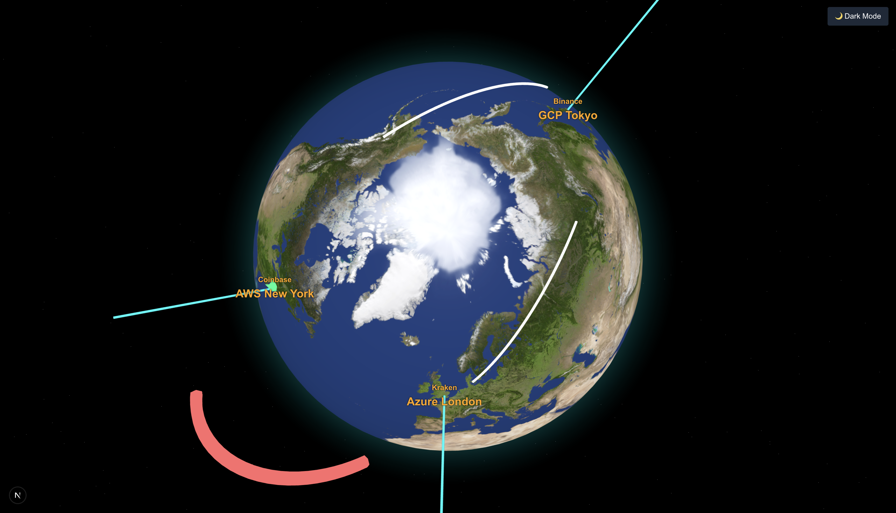
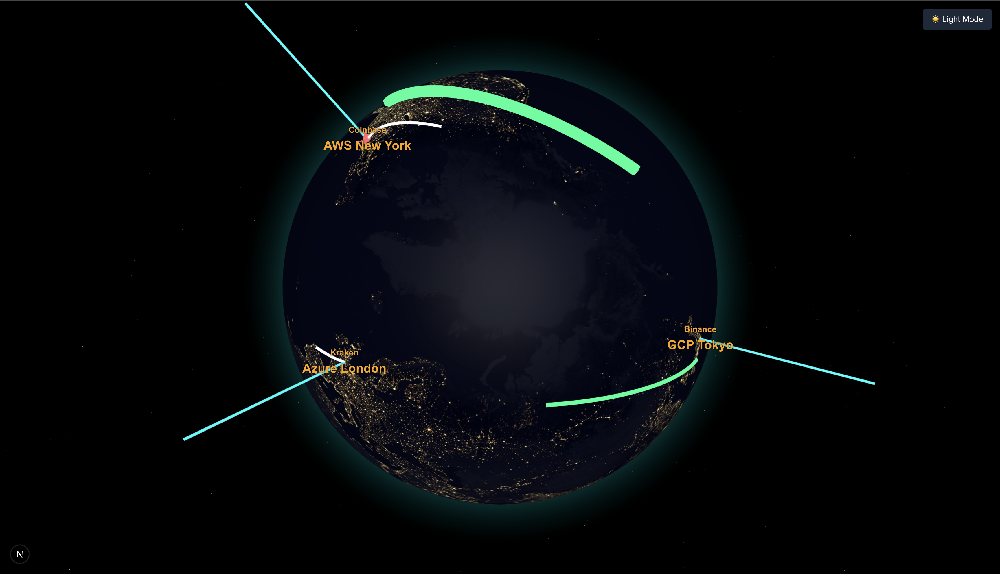

# 🌍 Latency Topology Visualizer

An interactive 3D globe built with **Next.js 14**, **Globe.gl**, and **TypeScript** to visualize real-time and historical latency data between exchange servers hosted across AWS, GCP, and Azure cloud regions — tailored for crypto trading infrastructure.

This project is designed to showcase real-time network latency for high-frequency trading, infrastructure architecture, and cloud performance insight.

---

## ✨ Features

- 🌐 3D globe with animated **latency arcs** using `globe.gl`
- 📍 Exchange server **markers** by region and provider
- 🌠 Starfield background (custom Three.js stars)
- 🛰 Real-time **animated arcs** representing latency
- 🧭 Auto-rotating camera with orbit controls
- ⚙️ Built with **Next.js App Router**, **TypeScript**, **TailwindCSS**
- 🧪 Ready for API integrations: Cloudflare Radar, RIPE Atlas
- 📱 Mobile-friendly and optimized for performance

---

## 🔗 Live Demo

Link to video: [https://drive.google.com/file/d/1daEszC3zTFMBW_Jf77TwxqZ1bfQ066O5/view?usp=sharing]

> Deployed on [Vercel](https://latency-topology-visualizer-omega.vercel.app/)

---

## 📸 Screenshots





---

## 🧠 Tech Stack

| Layer        | Tech                          |
|--------------|-------------------------------|
| Frontend     | Next.js 14 (App Router)       |
| Language     | TypeScript                    |
| 3D Engine    | `globe.gl` + `three.js`       |
| Styling      | TailwindCSS                   |
| State (WIP)  | `zustand` or `jotai` (optional) |
| Charting     | Recharts / Chart.js (WIP)     |
| Data Source  | Static + public latency APIs  |

---

## 📁 Project Structure
```
latency-topology-visualizer/
├── app/
│ ├── layout.tsx # Global layout and <head>
│ └── page.tsx # Entry point and globe mount
├── components/
│ └── GlobeCanvas.tsx # Main 3D globe rendering logic
├── lib/
│ ├── latency.ts # Latency arc connection data
│ └── servers.ts # Exchange/cloud server metadata
├── types/
│ ├── exchange.ts # Server TS types
│ └── latency.ts # Latency types
├── public/
│ ├── earth-dark.jpg # Globe texture
│ └── favicon.ico # Favicon for browser tabs
├── styles/
│ └── globals.css # Tailwind base styles
├── README.md
├── package.json
├── tailwind.config.ts
└── tsconfig.json

yaml
Copy
Edit
```
---

## ⚙️ Installation & Running Locally

```bash
# Clone the repository
git clone https://github.com/aniket15desai/latency-topology-visualizer.git

cd latency-topology-visualizer

# Install dependencies
npm install

# Run the dev server
npm run dev
Then open http://localhost:3000 in your browser.

🧪 Sample Data
Latency and server metadata are currently mocked for demo purposes:

lib/servers.ts – exchange server locations and regions

lib/latency.ts – sample latency between locations

🔗 To use live data:

Cloudflare Radar

RIPE Atlas API

AWS/GCP/Azure Cloud Ping API (via third party or traceroute)

🛠️ Building for Production
bash
Copy
Edit
npm run build
npm start
You can deploy to any Vercel, Netlify, or custom server.

🌠 Starfield Setup
The app uses three.js directly to generate a deep-space star background rendered behind the globe using Points.